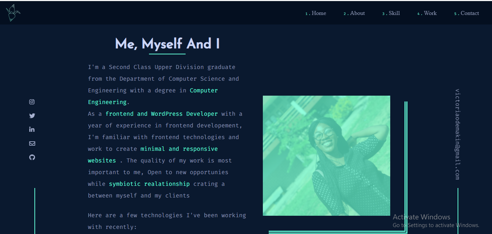
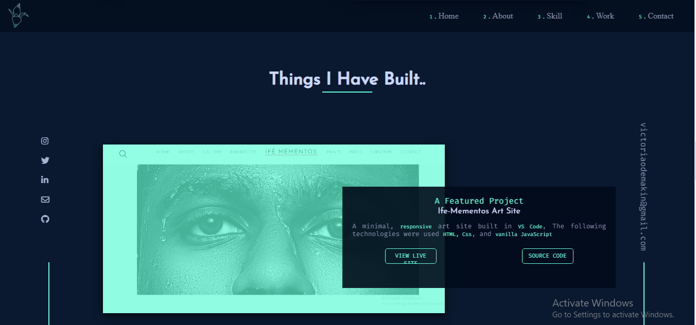
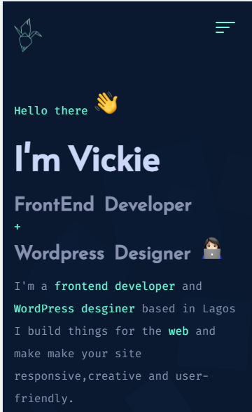
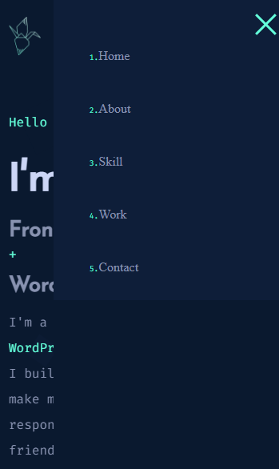

# My Portfolio

This is the [update of my personnal portfolio ](https://victoriaodemakin.github.io/VictoriaOdemakin-Portfolio/).

## Table of contents

- [Overview](#overview)

  - [Screenshot](#screenshot)
  - [Links](#links)
  - [Built with](#built-with)
  - [What I learned](#what-i-learned)
  - [Continued development](#continued-development)

## Main Overview

The overview of the project is to build out my first ever portfolio site. The site is responsive for both mobile,tablet and a desktop version of the design.

### The site overview

Users should be able to:

- View the optimal layout for the site depending on their device's screen size
- See hover states for all interactive elements on the page
  The designs were created to the following widths:

- Mobile: 375px
  -Tablet: 768px
- Desktop: 1440px

### Screenshot

### The desktop site overview

Users should be able to:

- View the optimal layout for the site depending on their device's screen size
- See hover states for all interactive elements on the page
  The designs were created to the following widths:

  -Tablet: 768px

- Desktop: 1440px

###

###

### The mobile site overview

Users should be able to:

- View the optimal layout for the site depending on their device's screen size
- See hover states for all interactive elements on the page
  The designs were created to the following widths:

- Mobile: 375px
  

###

###

### Links

- Live Site URL: [live site URL ](https://victoriaodemakin.github.io/VictoriaOdemakin-Portfolio/)

## My process

### Built with

- Semantic HTML5 markup
- CSS custom properties
- Flexbox
- CSS Grid
- GSAP Js
- ScrollTrigger Plugin
- Mobile-first workflow
- [Javascript](https://reactjs.org/) - JS library
